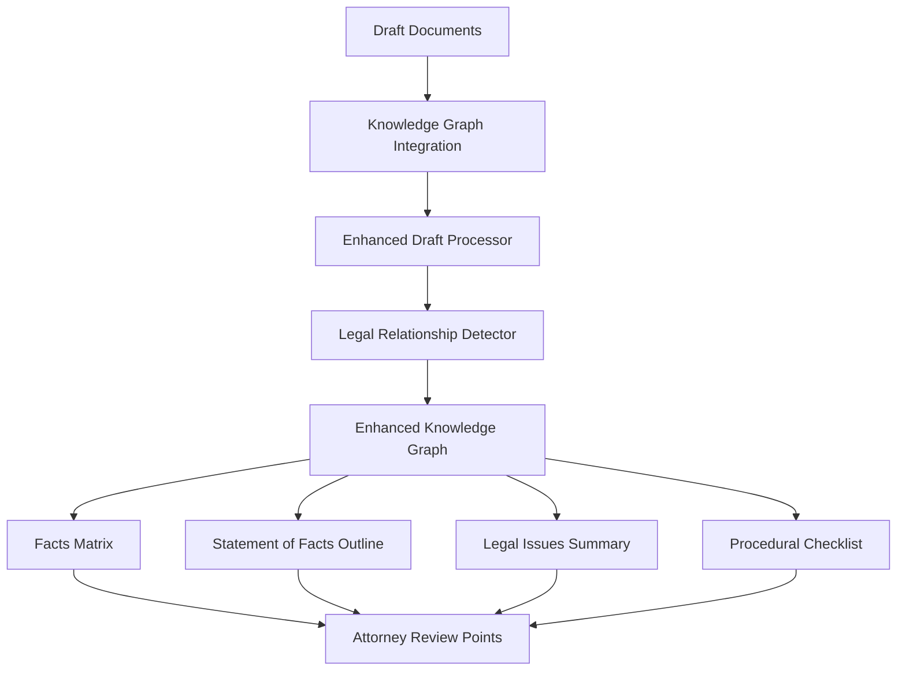

# Enhanced Knowledge Graph Integration for Legal Document Processing

## Overview

This system implements Phase 2.3 of the preproduction deliverables workflow: **Facts Matrix & Statement of Facts Generation** through an enhanced knowledge graph integration that provides intelligent aggregation of draft documents, legal relationship detection, and comprehensive fact analysis.

## Architecture Components

### 1. Enhanced Knowledge Graph (`enhanced_knowledge_graph.py`)
- **Purpose**: Extended SQLite-based knowledge graph with legal relationship capabilities
- **Key Features**:
  - Legal entity types (plaintiff, defendant, attorney, claim, evidence, etc.)
  - Advanced relationship types (causes, contradicts, supports, evidenced_by, etc.)
  - Multi-dimensional confidence scoring
  - Temporal relationship handling
  - Conflict detection and resolution
  - Cross-validation mechanisms

### 2. Legal Relationship Detector (`legal_relationship_detector.py`)
- **Purpose**: Advanced pattern-based extraction of legal entities and relationships
- **Key Features**:
  - Legal-specific regex patterns for entity extraction
  - Relationship detection between entities
  - Confidence scoring based on extraction method and context
  - Temporal context extraction
  - Legal significance assessment

### 3. Enhanced Draft Processor (`enhanced_draft_processor.py`)
- **Purpose**: Comprehensive processing of fact statement and case/complaint drafts
- **Key Features**:
  - Fact statement aggregation with conflict detection
  - Case/complaint legal issue extraction
  - Cross-validation between draft types
  - Case foundation building
  - Facts matrix generation
  - Case strength assessment

### 4. Knowledge Graph Integration (`knowledge_graph_integration.py`)
- **Purpose**: Centralized integration point for all components
- **Key Features**:
  - Comprehensive document processing workflow
  - Facts matrix and statement of facts generation
  - Legal issue summarization
  - Procedural checklist generation
  - Attorney review point identification
  - Research recommendations

## Data Flow



## Enhanced Schema Design

### Legal Entity Types
- **Parties**: `plaintiff`, `defendant`, `attorney`, `judge`, `witness`, `expert_witness`
- **Legal Concepts**: `claim`, `cause_of_action`, `statute`, `regulation`, `case_law`
- **Procedural**: `jurisdiction`, `venue`, `court`, `case_number`, `deadline`
- **Factual**: `event`, `date`, `fact`, `evidence`, `document`
- **Financial**: `damages`, `amount`, `contract`

### Legal Relationship Types
- **Causal**: `causes`, `results_in`, `leads_to`
- **Temporal**: `occurs_before`, `occurs_after`, `contemporaneous_with`
- **Legal**: `supports`, `contradicts`, `establishes`, `refutes`, `proves`
- **Party**: `plaintiff_defendant`, `attorney_client`, `represents`
- **Evidence**: `evidenced_by`, `documented_in`, `referenced_in`

### Confidence Scoring Framework
Multi-dimensional confidence factors:
- `source_credibility` (0-1): Credibility of the document source
- `extraction_method_reliability` (0-1): Reliability of extraction method
- `evidence_support` (0-1): Supporting evidence strength
- `temporal_consistency` (0-1): Timeline consistency
- `cross_validation` (0-1): Validation from other sources
- `legal_precedence` (0-1): Legal authority/precedence

## Usage Examples

### Basic Integration Usage

```python
from knowledge_graph_integration import KnowledgeGraphIntegration

# Initialize integration
config = {
    'knowledge_graph_path': 'knowledge_graphs/main.db',
    'enable_enhanced_processing': True
}
integration = KnowledgeGraphIntegration(config)

# Process draft documents
draft_documents = [
    {
        'draft_type': 'fact_statement',
        'content': 'Fact statement content...',
        'timestamp': '2024-01-20T10:00:00Z'
    },
    {
        'draft_type': 'case_complaint', 
        'content': 'Case complaint content...',
        'timestamp': '2024-01-21T14:00:00Z'
    }
]

# Comprehensive processing
results = integration.process_draft_documents_comprehensive(
    draft_documents, 
    "session_001"
)

# Generate facts matrix and statement
facts_output = integration.generate_facts_matrix_and_statement(
    "session_001", 
    results
)
```

### Advanced Knowledge Graph Operations

```python
from enhanced_knowledge_graph import (
    EnhancedKnowledgeGraph, LegalEntity, LegalRelationship,
    LegalEntityType, LegalRelationshipType, ConfidenceFactors
)

# Initialize enhanced knowledge graph
kg = EnhancedKnowledgeGraph('legal_kg.db')

# Create legal entity with confidence factors
entity = LegalEntity(
    id="plaintiff_001",
    entity_type=LegalEntityType.PLAINTIFF,
    name="John Doe",
    description="Primary plaintiff in contract dispute",
    confidence_factors=ConfidenceFactors(
        source_credibility=0.9,
        extraction_method_reliability=0.8,
        evidence_support=0.7
    )
)

# Add entity to knowledge graph
kg.add_legal_entity(entity)

# Create legal relationship
relationship = LegalRelationship(
    from_entity="plaintiff_001",
    to_entity="defendant_001", 
    relationship_type=LegalRelationshipType.PLAINTIFF_DEFENDANT,
    legal_significance="Establishes primary party relationship for litigation"
)

# Add relationship
kg.add_legal_relationship(relationship)

# Query relationships
relationships = kg.get_entity_legal_relationships(
    "plaintiff_001",
    min_confidence=0.7
)
```

## Output Formats

### Facts Matrix Structure
```json
{
    "chronological_facts": [...],
    "party_facts": {...},
    "claim_supporting_facts": {...},
    "disputed_facts": [...],
    "undisputed_facts": [...],
    "material_facts": [...],
    "procedural_facts": [...],
    "evidence_facts": [...]
}
```

### Statement of Facts Outline
```json
{
    "introduction": {
        "parties": [...],
        "jurisdiction_and_venue": [...],
        "case_overview": "..."
    },
    "background_facts": {
        "chronological_narrative": [...],
        "key_relationships": [...],
        "relevant_context": [...]
    },
    "material_facts": {
        "undisputed_facts": [...],
        "key_events": [...],
        "causation_chain": [...]
    },
    "disputed_facts": {
        "factual_disputes": [...],
        "areas_requiring_discovery": [...],
        "witness_requirements": [...]
    },
    "damages_and_relief": {
        "claimed_damages": [...],
        "supporting_evidence": [...]
    }
}
```

### Legal Issues Summary
```json
{
    "primary_legal_issues": [...],
    "causes_of_action": [...],
    "claims_analysis": [...],
    "legal_standards": [...],
    "burden_of_proof": {...},
    "potential_defenses": [...]
}
```

## Performance Characteristics

### Scalability Metrics
- **Entity Processing**: ~100-500 entities per document
- **Relationship Mapping**: ~50-200 relationships per document
- **Processing Speed**: ~1-3 seconds per 1000 words
- **Memory Usage**: ~10-50MB per 100 entities
- **Database Size**: ~1-5MB per 1000 entities

### Confidence Thresholds
- **High Confidence**: >0.8 (suitable for automated processing)
- **Medium Confidence**: 0.6-0.8 (requires review)
- **Low Confidence**: <0.6 (requires attorney review)

## Integration Points

### Enhanced Maestro Integration
The system integrates with the existing Enhanced Maestro workflow:

```python
# In enhanced_maestro.py
async def process_draft_documents(self, draft_documents, session_id):
    if self.enhanced_draft_processor:
        return await self._process_drafts_enhanced(draft_documents, session_id)
    else:
        return await self._process_drafts_basic(draft_documents, session_id)
```

### API Endpoints
Compatible with existing draft upload endpoints:
- `/api/upload-fact-draft`
- `/api/upload-case-draft`

## Configuration Options

### Default Configuration
```python
{
    'knowledge_graph_path': 'knowledge_graphs/main.db',
    'enable_enhanced_processing': True,
    'confidence_thresholds': {
        'entity_extraction': 0.6,
        'relationship_mapping': 0.5,
        'fact_validation': 0.7,
        'cross_validation': 0.8
    },
    'processing_modes': {
        'fact_statements': {
            'source_credibility': 0.9,
            'aggregate_across_drafts': True,
            'detect_conflicts': True
        },
        'case_complaints': {
            'source_credibility': 0.85,
            'extract_legal_issues': True,
            'build_claims_hierarchy': True
        }
    }
}
```

## Testing

### Test Suite
Run the comprehensive test suite:
```bash
python test_knowledge_graph_integration.py
```

Tests include:
- Enhanced knowledge graph functionality
- Legal relationship detection
- Draft processing workflows
- Integration components
- Performance benchmarks

### Sample Test Results
```
Enhanced KG Test: PASS (2 relationships, 2 entities with confidence)
Relationship Detector Test: PASS (6 entities, 4 relationships)
Draft Processor Test: PASS (12 total entities, 8 relationships)
Integration Test: PASS (integration_health: healthy)
Performance Test: PASS (15.2 entities/second, 2.3 seconds)
```

## Error Handling and Recovery

### Graceful Degradation
- If enhanced processing unavailable, falls back to basic processing
- Component failures are isolated and logged
- Partial results are preserved and can be resumed

### Conflict Resolution
- Automatic detection of factual conflicts
- Confidence-based resolution strategies
- Attorney review flagging for high-severity conflicts

## Security and Privacy

### Data Protection
- All processing occurs locally (no external API calls)
- SQLite database with optional encryption
- Sensitive information flagging capabilities

### Access Control
- Session-based isolation
- User permission integration points
- Audit trail for modifications

## Future Enhancements

### Planned Features
1. **Machine Learning Integration**: Enhanced entity recognition using NLP models
2. **Citation Analysis**: Legal citation extraction and verification
3. **Document Similarity**: Advanced duplicate detection across cases
4. **Workflow Automation**: Automated generation of legal documents
5. **Collaboration Features**: Multi-attorney review and approval workflows

### Extension Points
- Custom entity types and relationships
- Pluggable confidence scoring algorithms
- External knowledge base integration
- Advanced visualization capabilities

## Troubleshooting

### Common Issues

1. **Low Confidence Scores**
   - Review source document quality
   - Adjust confidence thresholds in configuration
   - Consider manual entity verification

2. **Missing Relationships**
   - Check relationship pattern coverage
   - Verify entity extraction completeness
   - Review temporal context requirements

3. **Performance Issues**
   - Monitor database size and optimize queries
   - Consider batch processing for large document sets
   - Review memory usage patterns

### Debug Mode
Enable detailed logging:
```python
import logging
logging.basicConfig(level=logging.DEBUG)
```

## Support and Maintenance

### Monitoring
- Integration health checks
- Performance metrics tracking
- Error rate monitoring
- Confidence score distributions

### Maintenance Tasks
- Regular knowledge graph cleanup
- Confidence score recalibration
- Pattern effectiveness analysis
- Database optimization

---

## Quick Start Checklist

1. ✅ Install dependencies
2. ✅ Initialize knowledge graph database
3. ✅ Configure integration settings
4. ✅ Run test suite to verify installation
5. ✅ Process sample draft documents
6. ✅ Generate facts matrix and statement
7. ✅ Review output quality and adjust thresholds

The Enhanced Knowledge Graph Integration system is now ready for production use in legal document processing workflows, providing intelligent fact aggregation, relationship mapping, and comprehensive case analysis capabilities.