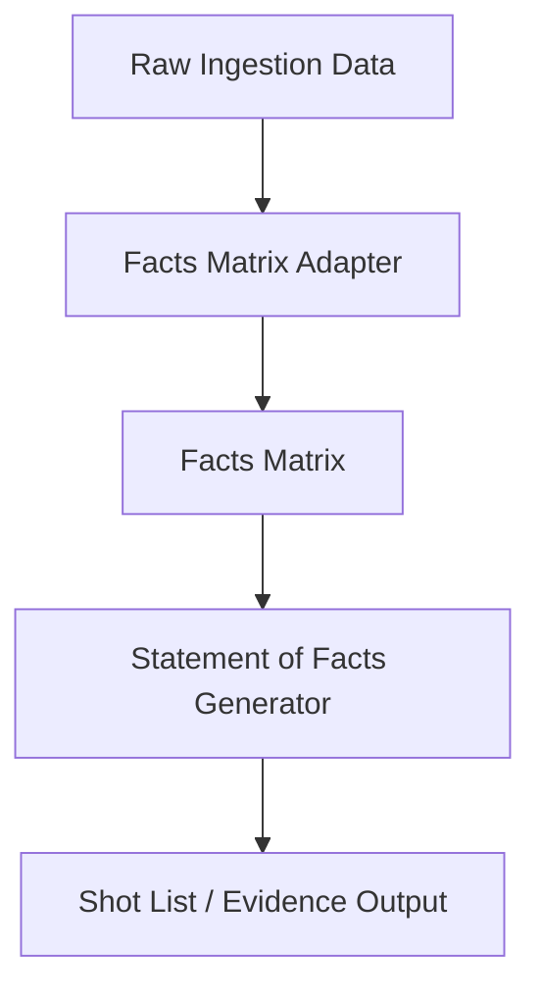
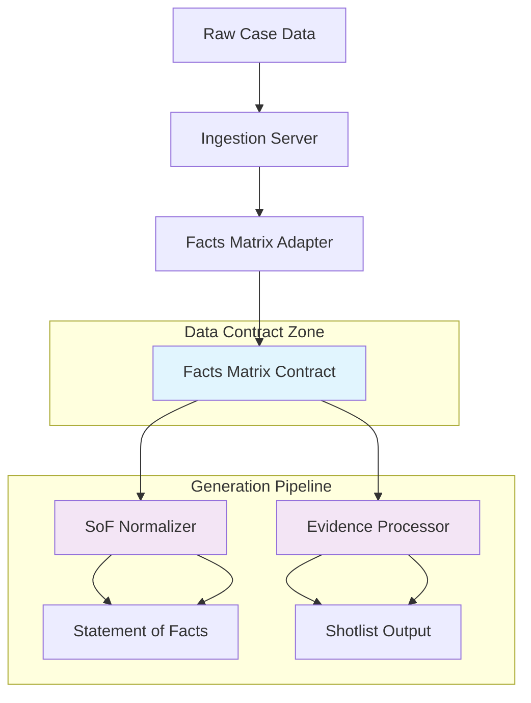

# System Documentation

## Architecture Overview

This document provides a high-level overview of the LawyerFactory system architecture, focusing on the primary data flow from ingestion to document generation.

### Data Flow

The system follows a linear data flow, with each component responsible for a specific stage of the process:

1.  **Ingestion**: Raw data is received by the ingestion server.
2.  **Facts Matrix Adapter**: The adapter transforms the raw data into a canonical `facts_matrix` format.
3.  **Statement of Facts Generator**: The generator processes the `facts_matrix` to create a structured legal document.
4.  **Shot List / Evidence Output**: The final output is a shot list of evidence, which is used for reporting and analysis.

### Mermaid Diagram



### Key Components

*   **Ingestion Server**: [`src/lawyerfactory/ingest/server.py`](src/lawyerfactory/ingest/server.py)
*   **Facts Matrix Adapter**: [`src/lawyerfactory/ingest/adapters/facts_matrix_adapter.py`](src/lawyerfactory/ingest/adapters/facts_matrix_adapter.py)
*   **Statement of Facts Generator**: [`src/lawyerfactory/compose/strategies/statement_of_facts.py`](src/lawyerfactory/compose/strategies/statement_of_facts.py)
*   **Shot List**: [`src/lawyerfactory/evidence/shotlist.py`](src/lawyerfactory/evidence/shotlist.py)

## Data Contracts (Canonical)

### Facts Matrix Contract
The Facts Matrix serves as the primary data interface between ingestion and generation components:

**Required Fields:**
- `undisputed_facts: List[str]` - Facts accepted by all parties
- `disputed_facts: List[str]` - Facts in contention
- `procedural_facts: List[str]` - Court procedures and timelines
- `case_metadata: Dict[str, Any]` - Case identifiers, court info
- `evidence_references: Dict[str, Any]` - Evidence catalog with metadata

**Optional Fields (with safe defaults):**
- `key_events: List[Any]` - Timeline highlights (defaults to `[]`)
- `background_context: List[Any]` - Case background (defaults to `[]`)
- `damages_claims: List[Any]` - Financial claims (defaults to `[]`)

### API Signatures
```python
# FactsMatrixAdapter
def process(raw_data: Dict[str, Any]) -> Dict[str, Any]

# StatementOfFactsGenerator
def generate(case_data: CaseData, facts_matrix: Dict[str, Any]) -> str

# ShotlistBuilder
def build(evidence_data: Dict[str, Any]) -> Dict[str, Any]
```

## Enhanced Data Flow Diagram



## Verification & Testing

**End-to-End Test Harness:** [`tests/test_end_to_end_lightweight.py`](tests/test_end_to_end_lightweight.py)
- Validates complete pipeline: Ingestion → Facts Matrix → SoF → Shotlist
- Verifies data contract compliance and graceful error handling
- Non-blocking design that handles missing modules gracefully

## Implementation Notes

**Robustness Principles:**
1. **Graceful Degradation:** Missing optional fields default to empty collections
2. **Contract Validation:** Required fields must be present and properly typed
3. **Error Boundaries:** Each component handles malformed input gracefully
4. **Observability:** Components log processing statistics and errors

**Alignment Goals:**
- Ensure [`FactsMatrixAdapter.process()`](src/lawyerfactory/ingest/adapters/facts_matrix_adapter.py:1) output matches contract
- Verify [`StatementOfFactsGenerator.normalize_facts_matrix()`](src/lawyerfactory/compose/strategies/statement_of_facts.py:1) handles all contract fields
- Confirm [`ShotlistBuilder.build()`](src/lawyerfactory/evidence/shotlist.py:1) processes evidence references correctly