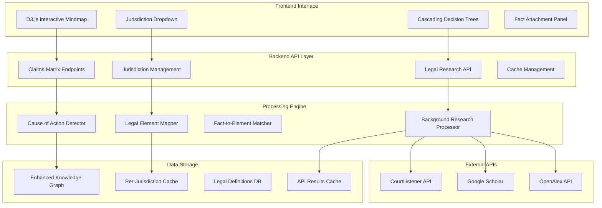

# Interactive Claims Matrix Implementation Plan - Phase 3.1

## Architecture Summary

The Interactive Claims Matrix will be a 2D D3.js mindmap with:
- **Visualization**: Force-directed graph with cause of action hubs
- **Jurisdiction**: Single jurisdiction focus with dropdown switching
- **Research**: Background processing with real-time click responses  
- **Integration**: Extends existing LawyerFactory knowledge graph system

## System Architecture

## Key Design Decisions

1. **Single Jurisdiction Focus**: Users select one jurisdiction at a time via dropdown
2. **Separate Caching**: Each jurisdiction maintains independent cached data
3. **Background Processing**: Pre-fetch relevant case law based on identified causes
4. **Real-time Clicks**: Immediate response from cache when users click concepts
5. **2D Force-Directed**: D3.js network visualization with smooth animations

## Database Schema Extensions

### Claims Matrix Tables
- `causes_of_action`: Core cause of action definitions per jurisdiction
- `legal_elements`: Element breakdown with provable questions  
- `element_questions`: Specific provable questions for each element
- `jurisdiction_authorities`: Legal authority hierarchy per jurisdiction
- `fact_element_attachments`: Links case facts to specific legal elements

### Caching Tables  
- `legal_research_cache`: Cached API results with jurisdiction keys
- `definition_cache`: Legal definition cache per jurisdiction
- `case_law_cache`: Relevant case law cache with relevance scoring

## Performance Targets

- **Mindmap Load Time**: <2 seconds for 20+ cause of action nodes
- **Jurisdiction Switch**: <1 second to load cached jurisdiction data
- **Click Response**: <300ms for cached legal definitions
- **Background Research**: Complete within 30 seconds of cause identification
- **Cache Hit Rate**: 90%+ for common legal concepts per jurisdiction