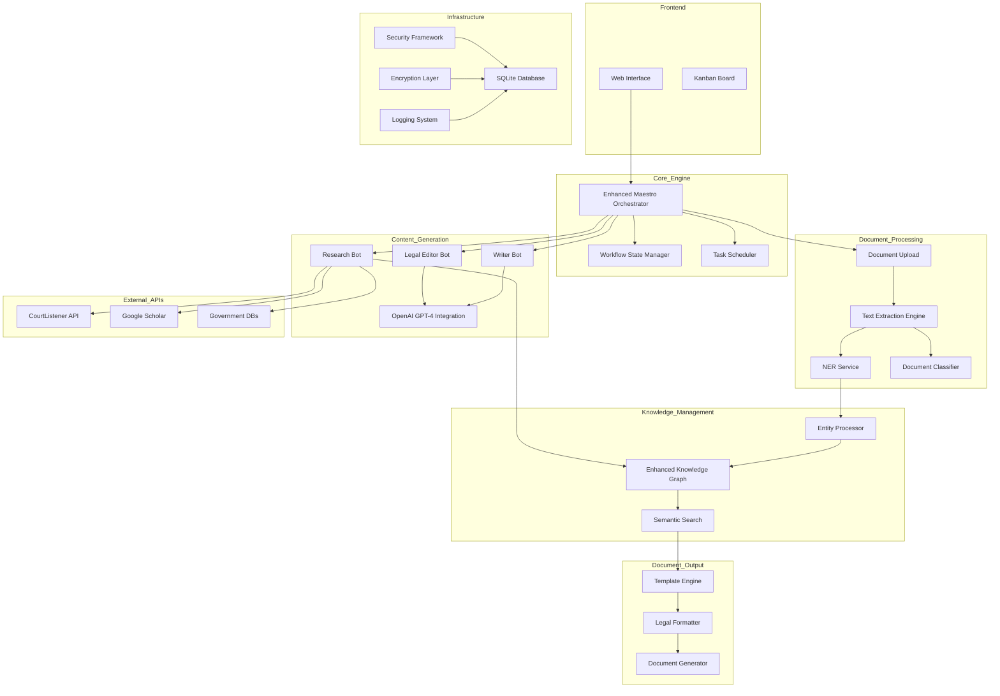

 # LawyerFactory Implementation Roadmap

## Architecture Summary

Based on the comprehensive system architecture analysis, the LawyerFactory system requires transformation from its current prototype state into a production-ready legal document automation platform. This roadmap consolidates all architectural specifications into actionable implementation phases.

## Current State Analysis

### Existing Components
✅ **Basic Web Interface** (`factory.html`) - Interactive workflow visualization  
✅ **Agent Framework** (`maestro/`) - Basic bot interface and placeholder implementations  
✅ **Workflow Management** (`lawyerfactory/`) - Task progression and Kanban board  
✅ **Knowledge Graph Foundation** (`knowledge_graph.json`) - Basic entity/relationship storage  

### Critical Gaps Identified
❌ **LLM Integration** - No OpenAI GPT-4 integration  
❌ **Document Processing** - No PDF parsing or text extraction  
❌ **Legal Research APIs** - No CourtListener/legal database connections  
❌ **NER Capabilities** - No named entity recognition for legal entities  
❌ **Document Templates** - No legal document generation templates  
❌ **Security Framework** - No authentication or data encryption  

## Complete System Architecture

## Implementation Phases

### Phase 1: Core Infrastructure (Weeks 1-3)
**Priority: Critical Foundation**

1. **Enhanced Maestro Orchestrator**
   - Implement workflow state management
   - Add task scheduling and dependency handling
   - Create checkpoint/recovery system
   - Build event bus for component communication

2. **Knowledge Graph Enhancement**
   - Migrate from JSON to SQLite with encryption
   - Implement entity/relationship schemas
   - Add semantic search capabilities
   - Create entity deduplication logic

3. **Security Framework**
   - Implement local data encryption (SQLCipher)
   - Add API key secure storage
   - Create audit logging system
   - Design file system permissions

### Phase 2: Document Processing (Weeks 3-5)
**Priority: High - Core Functionality**

1. **Document Ingestion Pipeline**
   - Build PDF text extraction (PyMuPDF + OCR fallback)
   - Implement document validation and classification
   - Create metadata extraction service
   - Add document storage and indexing

2. **Named Entity Recognition**
   - Integrate spaCy for legal entity extraction
   - Implement pattern-based legal entity patterns
   - Create entity confidence scoring
   - Build entity relationship discovery

### Phase 3: LLM Integration (Weeks 4-6)
**Priority: High - Content Generation**

1. **OpenAI GPT-4 Integration**
   - Implement OpenAI SDK integration
   - Create prompt optimization for legal content
   - Add token usage tracking and cost control
   - Build content quality validation

2. **Specialized Agent Implementation**
   - Enhance ResearchBot with LLM capabilities
   - Implement WriterBot for legal document drafting
   - Create LegalEditorBot for IRAC compliance
   - Build context management for agent coordination

### Phase 4: Research Capabilities (Weeks 5-7)
**Priority: Medium - Research Enhancement**

1. **Legal Research Integration**
   - Implement CourtListener API client
   - Create Google Scholar scraping (rate-limited)
   - Add government database API connections
   - Build research result validation and citation formatting

2. **Research Bot Enhancement**
   - Create legal precedent discovery algorithms
   - Implement jurisdiction-specific research
   - Add case law relevance scoring
   - Build research result caching

### Phase 5: Document Generation (Weeks 6-8)
**Priority: Medium - Output System**

1. **Template Engine**
   - Create Jinja2-based legal document templates
   - Implement IRAC structure templates
   - Add jurisdiction-specific formatting rules
   - Build template validation system

2. **Legal Formatting**
   - Implement Bluebook citation formatting
   - Create court-specific document formatting
   - Add legal language standardization
   - Build document structure validation

### Phase 6: Quality Assurance (Weeks 7-9)
**Priority: Medium - Reliability**

1. **Error Handling and Logging**
   - Implement comprehensive error handling
   - Create structured logging system
   - Add performance monitoring
   - Build automated error recovery

2. **Quality Validation**
   - Create legal content validation rules
   - Implement citation accuracy checking
   - Add factual consistency verification
   - Build template completeness validation

### Phase 7: Performance Optimization (Weeks 8-10)
**Priority: Low - Enhancement**

1. **Performance Tuning**
   - Implement async processing optimization
   - Add caching for research results
   - Create batch processing capabilities
   - Build progressive loading for large documents

2. **Scalability Preparation**
   - Optimize database queries and indexing
   - Implement resource usage monitoring
   - Add memory management optimization
   - Create performance benchmarking

## Technical Specifications Summary

### Technology Stack
- **Backend**: Python 3.11+ with asyncio
- **Database**: SQLite with SQLCipher encryption
- **LLM**: OpenAI GPT-4 (single provider for cost control)
- **Document Processing**: PyMuPDF, PyPDF2, python-docx, Tesseract OCR
- **NER**: spaCy with custom legal entity models
- **Web Framework**: Flask/FastAPI for local server
- **Frontend**: Enhanced HTML/JavaScript (existing factory.html)

### Performance Targets
- Document processing: < 30 seconds for 50-page PDF
- Research queries: < 2 minutes for comprehensive search
- Content generation: < 1 minute per document section
- Full lawsuit generation: < 15 minutes end-to-end

### Security Requirements
- Local desktop deployment for data privacy
- Encrypted local database storage
- Secure API key management
- Comprehensive audit logging
- File system sandboxing

## Resource Requirements

### Development Team
- **Lead Architect/Senior Developer**: Full-time (Phases 1-7)
- **Backend Developer**: Full-time (Phases 2-6)
- **Frontend Developer**: Part-time (Phases 1, 5-6)
- **QA Engineer**: Part-time (Phases 4-7)

### External Dependencies
- OpenAI GPT-4 API access and billing setup
- CourtListener API registration
- Legal document templates and formatting standards
- Test legal documents for validation

### Infrastructure
- Development environment setup
- Local testing infrastructure
- Performance testing framework
- Documentation and deployment tools

## Risk Assessment and Mitigation

### High Risk
1. **LLM Cost Control**: Implement token tracking and usage limits
2. **Legal Accuracy**: Create validation frameworks and human review checkpoints
3. **Performance**: Design with async processing and caching from start

### Medium Risk
1. **API Rate Limits**: Implement proper rate limiting and fallback strategies
2. **Document Quality**: Build OCR fallback and quality assessment
3. **User Experience**: Maintain existing web interface compatibility

### Low Risk
1. **Technology Integration**: Well-established libraries and APIs
2. **Local Deployment**: Simplified by desktop-only architecture
3. **Security**: Standard encryption and local storage practices

## Success Metrics

### Functional Metrics
- Successfully process 95% of uploaded legal PDFs
- Generate legally-formatted documents in under 15 minutes
- Achieve 90% accuracy in entity extraction
- Complete 7-phase workflow without manual intervention

### Performance Metrics
- Average document processing time < 30 seconds
- System memory usage < 2GB during peak operation
- 99% uptime for local desktop application
- Zero data breaches or security incidents

### Quality Metrics
- Legal citations formatted to Bluebook standards
- IRAC structure compliance in generated documents
- Human review approval rate > 85%
- Template completeness validation 100% pass rate

This implementation roadmap provides a comprehensive blueprint for transforming the LawyerFactory prototype into a production-ready legal document automation system, with clear phases, timelines, and success criteria.