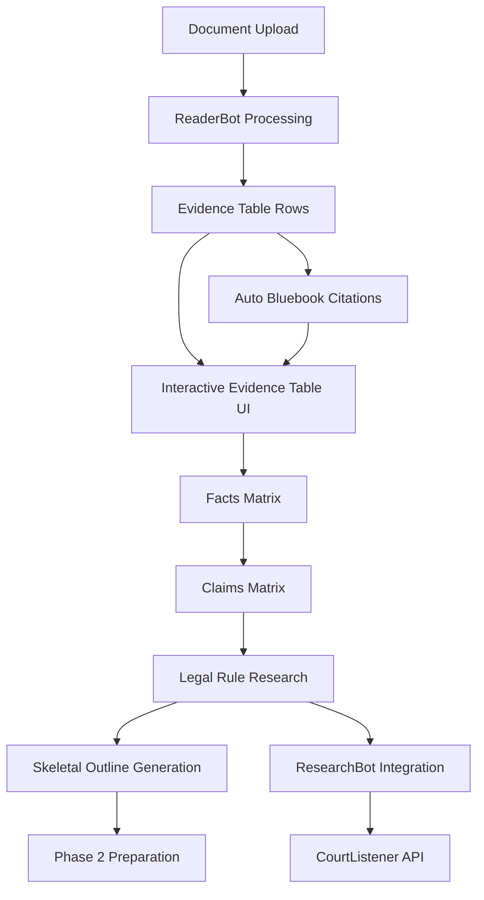

# Evidence Table to Claims Matrix Implementation Plan

## Current State Analysis

Based on my review of the LawyerFactory codebase, here's what exists and what needs to be built:

### ✅ Current Components
- Basic evidence table structure (`evidence_table.json`) 
- Document ingestion via `ingest-server.py` and `reader_bot.py`
- Research capabilities via `research_bot.py` with CourtListener integration
- 7-phase workflow orchestration via `enhanced_maestro.py`
- Web interface with real-time updates via Socket.IO

### ❌ Missing Components
- Interactive sortable/filterable evidence table UI
- Facts matrix linking evidence to factual assertions
- Claims matrix linking facts to causes of action with legal standards
- Automated legal rule research and suggestion system
- Bluebook citation generation and formatting
- Phase 2 outline generation triggered by evidence processing

## Architecture Overview



## Implementation Plan

### Phase 1: Enhanced Evidence Table
1. **Extend Evidence Table Schema**
   - Add fields: evidence_id, source_document, page_section, evidence_type, relevance_score, supporting_facts, bluebook_citation
   - Create database migration for existing evidence_table.json

2. **Build Interactive UI Components**
   - Create sortable/filterable DataTable component
   - Add export functionality (CSV, PDF)
   - Implement real-time updates via Socket.IO
   - Add evidence type classification dropdown

3. **Integrate with Document Processing**
   - Modify `reader_bot.py` to populate enhanced evidence table
   - Add automatic evidence extraction from processed documents
   - Link evidence entries to source document metadata

### Phase 2: Facts Matrix Integration
4. **Create Facts Matrix Data Model**
   - Design fact assertion schema with evidence linking
   - Implement many-to-many relationship between evidence and facts
   - Add fact confidence scoring

5. **Build Facts Matrix UI**
   - Create drag-and-drop interface for linking evidence to facts
   - Add fact assertion editing capabilities
   - Implement visual relationship mapping

### Phase 3: Claims Matrix and Legal Research
6. **Develop Claims Matrix Framework**
   - Create cause of action schema with fact dependencies
   - Build legal element checklist system
   - Add claims confidence scoring

7. **Enhance ResearchBot for Rule Discovery**
   - Extend `research_bot.py` to search for legal standards by cause of action
   - Add judicial test extraction from case law
   - Implement rule confidence scoring and human review queue

8. **Build Bluebook Citation Generator**
   - Create citation formatting module
   - Integrate with research results
   - Add manual citation editing interface

### Phase 4: Outline Generation
9. **Create Skeletal Outline Generator**
   - Build template system for complaint structures
   - Implement fact-to-claim mapping for outline sections
   - Add automatic section generation based on claims matrix

10. **Integrate with Phase 2 Workflow**
    - Trigger outline generation after evidence processing
    - Create human approval checkpoints
    - Prepare structured data for drafting phase

## Data Models

### Enhanced Evidence Table
```json
{
  "evidence_id": "string",
  "source_document": "string",
  "page_section": "string", 
  "content": "string",
  "evidence_type": "enum[documentary, testimonial, expert, physical]",
  "relevance_score": "float",
  "supporting_facts": ["fact_id_array"],
  "bluebook_citation": "string",
  "privilege_marker": "enum[none, attorney_client, work_product]",
  "created_at": "timestamp",
  "last_modified": "timestamp"
}
```

### Facts Matrix
```json
{
  "fact_id": "string",
  "fact_assertion": "string",
  "confidence_score": "float",
  "supporting_evidence": ["evidence_id_array"],
  "related_claims": ["claim_id_array"],
  "chronological_order": "integer"
}
```

### Claims Matrix
```json
{
  "claim_id": "string",
  "cause_of_action": "string",
  "legal_elements": [
    {
      "element_name": "string",
      "supporting_facts": ["fact_id_array"],
      "legal_standard": "string",
      "court_test": "string",
      "citations": ["citation_array"]
    }
  ],
  "claim_strength": "float"
}
```

## Technical Requirements

### Frontend Components
- DataTable with sorting, filtering, pagination
- Drag-and-drop interface for fact-evidence linking
- Modal dialogs for editing evidence/facts/claims
- Real-time Socket.IO updates
- Export functionality

### Backend Enhancements
- Extended API endpoints for CRUD operations
- Enhanced database schema
- Integration with existing workflow phases
- Research automation workflows

### Integration Points
- `ingest-server.py` evidence table API extension
- `reader_bot.py` evidence extraction enhancement
- `research_bot.py` legal rule discovery
- `enhanced_maestro.py` phase transition triggers

This plan provides a structured approach to implementing the evidence-to-claims workflow while building on the existing LawyerFactory architecture.