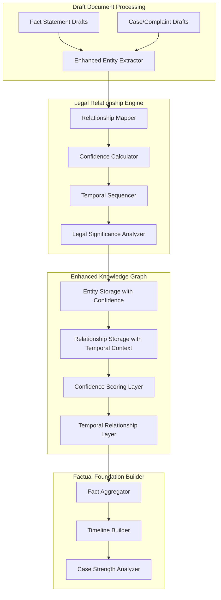

# Knowledge Graph Integration & Fact Aggregation - Phase 2.3 Implementation Plan

## Focus: Enhanced Legal Entity Relationship Mapping with Confidence Scoring and Temporal Sequencing

### Architecture Overview

## Implementation Todo List

### Phase 1: Enhanced Knowledge Graph Schema for Legal Relationships

1. **Design Enhanced Entity Storage Schema**
   - Extend existing entities table with legal_relationship_attributes field
   - Add entity_confidence_metrics table for dynamic confidence tracking
   - Create entity_temporal_context table for time-based entity states
   - Add entity_verification_history table for confidence audit trail

2. **Create Advanced Relationship Schema**
   - Design legal_relationships table with temporal_validity periods
   - Add relationship_confidence_factors table for multi-dimensional scoring
   - Create relationship_evidence_support table linking relationships to supporting evidence
   - Implement relationship_hierarchy table for nested legal relationships

3. **Build Temporal Sequencing Infrastructure**
   - Create temporal_events table for chronological fact ordering
   - Design temporal_relationships table for before/after/during relationships
   - Add timeline_segments table for case phase organization
   - Implement temporal_confidence_decay functions for time-sensitive facts

### Phase 2: Legal Entity Relationship Detection Engine

4. **Implement Enhanced Entity Extraction**
   - Extend existing NER with legal-specific entity patterns
   - Add confidence boosting for draft-sourced entities
   - Create entity disambiguation logic for similar names/references
   - Implement entity canonical_name resolution for consistency

5. **Build Legal Relationship Detection Logic**
   - Create pattern-based legal relationship detection
   - Implement semantic relationship inference using embeddings
   - Add causation relationship detection for fact chains
   - Build contradiction detection for conflicting relationships

6. **Develop Confidence Scoring System**
   - Create multi-factor confidence calculation algorithm
   - Implement source credibility weighting system
   - Add evidence-based confidence boosting
   - Build confidence decay models for time-sensitive information

### Phase 3: Temporal Sequencing and Legal Significance

7. **Implement Temporal Relationship Engine**
   - Create chronological ordering system for events and facts
   - Build temporal consistency validation
   - Add timeline gap detection and flagging
   - Implement temporal relationship inference

8. **Build Legal Significance Analyzer**
   - Create legal significance scoring for relationships
   - Implement materiality assessment for fact relationships
   - Add causation strength analysis
   - Build legal precedence impact scoring

9. **Develop Relationship Strength Metrics**
   - Create relationship confidence aggregation from entity confidences
   - Implement supporting evidence strength calculation
   - Add cross-validation scoring for relationship consistency
   - Build relationship weakness identification

### Phase 4: Draft Document Aggregation Logic

10. **Enhance Draft Document Processing**
    - Extend enhanced_maestro.py with relationship-focused processing
    - Add entity relationship extraction from draft documents
    - Implement draft priority handling based on relationship strength
    - Create draft conflict detection at relationship level

11. **Build Intelligent Fact Aggregation**
    - Create fact consolidation logic based on entity relationships
    - Implement relationship-based fact verification
    - Add fact strength scoring using relationship confidence
    - Build fact timeline construction from temporal relationships

12. **Implement Conflict Resolution Framework**
    - Create relationship conflict detection system
    - Add automated resolution rules for common conflicts
    - Implement attorney review queue for complex conflicts
    - Build conflict resolution audit trail

### Phase 5: Integration with Existing Systems

13. **Integrate with Enhanced Maestro**
    - Extend process_draft_documents with relationship mapping
    - Add relationship extraction to _extract_legal_entities function
    - Implement confidence-based entity storage in _store_foundational_knowledge
    - Create relationship validation in knowledge graph integration

14. **Enhance Knowledge Graph Extensions**
    - Add relationship confidence queries to knowledge_graph_extensions.py
    - Implement temporal relationship retrieval functions
    - Create legal significance filtering for relationships
    - Add relationship strength statistics

15. **Connect to Evidence Table System**
    - Link entity relationships to supporting evidence entries
    - Add relationship strength indicators to evidence relevance scoring
    - Implement evidence-relationship cross-validation
    - Create relationship-based evidence gap identification

### Phase 6: Output Generation and Validation

16. **Build Facts Matrix with Relationship Context**
    - Create relationship-aware fact organization
    - Implement temporal fact sequencing using relationship chronology
    - Add relationship strength indicators to fact presentation
    - Build relationship-based fact verification status

17. **Create Relationship Visualization Tools**
    - Implement entity relationship network visualization
    - Add temporal relationship timeline views
    - Create confidence heatmaps for relationship strengths
    - Build interactive relationship exploration interface

18. **Implement Quality Assurance Framework**
    - Create relationship consistency validation rules
    - Add confidence threshold enforcement
    - Implement relationship completeness checking
    - Build relationship accuracy metrics and reporting

### Phase 7: Performance Optimization and Testing

19. **Optimize Relationship Query Performance**
    - Add database indexes for relationship queries
    - Implement relationship caching for frequent access patterns
    - Create batch processing for large relationship sets
    - Add relationship query optimization

20. **Create Comprehensive Testing Framework**
    - Build unit tests for relationship detection algorithms
    - Create integration tests for temporal sequencing
    - Add confidence scoring validation tests
    - Implement end-to-end relationship mapping tests

## Success Metrics

- **Relationship Detection Accuracy**: >85% precision for legal relationships
- **Confidence Scoring Reliability**: Confidence scores correlate with attorney assessments
- **Temporal Sequencing Accuracy**: >90% accuracy for chronological ordering
- **Draft Aggregation Efficiency**: Reduces manual fact consolidation time by 70%
- **Legal Significance Recognition**: Identifies critical relationships for case building

## Technical Implementation Notes

- **Database Performance**: Use SQLite indexes optimized for relationship queries
- **Memory Management**: Implement lazy loading for large relationship networks
- **Scalability**: Design for cases with 1000+ entities and 5000+ relationships
- **Integration**: Maintain backward compatibility with existing knowledge graph API
- **Testing**: Use Tesla case data for validation and performance benchmarking