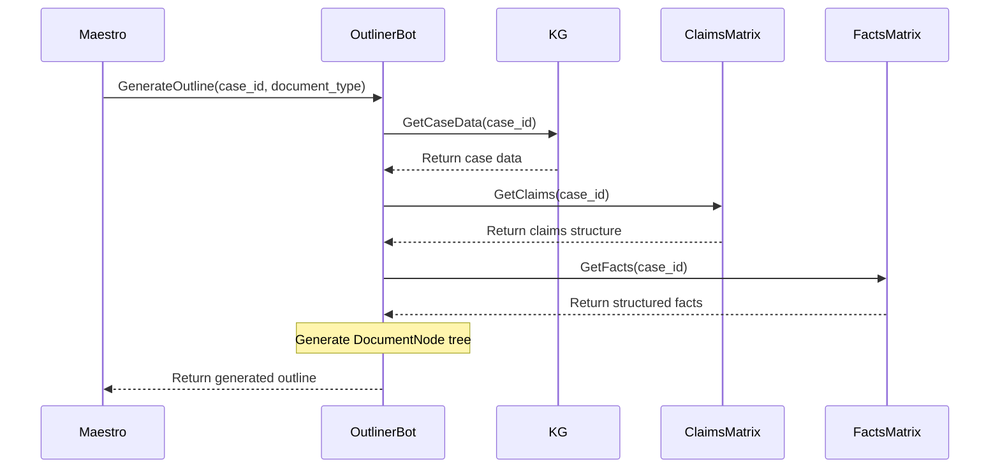

# Skeletal Outline Generation System: Architectural Design

## 1. Core Document Framework

This section details the foundational components of the skeletal outline generation system. The framework is designed to be modular and extensible, supporting a variety of document types through a recursive, template-driven approach.

### 1.1. The Recursive Document Model: `DocumentNode`

The entire document structure is represented by a tree of `DocumentNode` objects. This allows for arbitrary depth and complexity, which is essential for handling recursive structures like the 1-3-1 sandwich model.

```python
from dataclasses import dataclass, field
from typing import List, Dict, Any, Optional

@dataclass
class ContentRequirement:
    """Specifies content requirements for a document section."""
    prompt: str  # LLM prompt to generate content
    min_word_count: int = 100
    max_word_count: int = 500
    keywords: List[str] = field(default_factory=list)

@dataclass
class DocumentNode:
    """A recursive node representing a section of a document."""
    section_id: str
    title: str
    level: int
    content_requirement: Optional[ContentRequirement] = None
    children: List['DocumentNode'] = field(default_factory=list)
    metadata: Dict[str, Any] = field(default_factory=dict)
    # For legal documents
    is_numbered: bool = False
    is_paragraph: bool = False
```

### 1.2. Document Type Framework: `DocumentTemplate`

Each document type (e.g., `complaint`, `business_proposal`) is defined by a `DocumentTemplate`. This template specifies the hierarchy of sections and their content requirements.

```python
@dataclass
class DocumentTemplate:
    """Defines the structure for a specific document type."""
    template_id: str
    document_type: str
    root_node: DocumentNode
```

### 1.3. The 1-3-1 Sandwich Writing Model

The 1-3-1 model (Introduction, 3 Supporting Points, Conclusion) is implemented recursively. A `DocumentNode` can be configured to follow this pattern. For example, a "Supporting Arguments" section in a legal brief could itself be a 1-3-1 structure.

This is enabled by the recursive nature of `DocumentNode`. A template can define a section that has three children, each of which can be a `DocumentNode` with its own children, potentially following the same 1-3-1 pattern.

**Example `DocumentTemplate` for a simple persuasive essay:**

```json
{
  "template_id": "persuasive_essay_v1",
  "document_type": "essay",
  "root_node": {
    "section_id": "essay_root",
    "title": "Persuasive Essay",
    "level": 0,
    "children": [
      {
        "section_id": "introduction",
        "title": "Introduction",
        "level": 1,
        "content_requirement": {
          "prompt": "Write a compelling introduction to the topic.",
          "max_word_count": 200
        }
      },
      {
        "section_id": "body",
        "title": "Body Paragraphs",
        "level": 1,
        "children": [
          {
            "section_id": "point_1",
            "title": "Supporting Point 1",
            "level": 2,
            "content_requirement": { "prompt": "Elaborate on the first supporting point." }
          },
          {
            "section_id": "point_2",
            "title": "Supporting Point 2",
            "level": 2,
            "content_requirement": { "prompt": "Elaborate on the second supporting point." }
          },
          {
            "section_id": "point_3",
            "title": "Supporting Point 3",
            "level": 2,
            "content_requirement": { "prompt": "Elaborate on the third supporting point." }
          }
        ]
      },
      {
        "section_id": "conclusion",
        "title": "Conclusion",
        "level": 1,
        "content_requirement": {
          "prompt": "Summarize the arguments and provide a concluding statement.",
          "max_word_count": 200
        }
      }
    ]
  }
}

## 2. Legal Document Structuring

This section extends the Core Document Framework to address the specific requirements of legal documents, ensuring compliance with standards like the Federal Rules of Civil Procedure (FRCP).

### 2.1. FRCP-Compliant Document Structures

We will create `DocumentTemplate`s for common legal documents. These templates will enforce the correct section hierarchy and formatting by defining a tree of `DocumentNode` objects.

**Example `DocumentTemplate` for a Legal Complaint:**

```json
{
  "template_id": "frcp_complaint_v1",
  "document_type": "legal_complaint",
  "root_node": {
    "section_id": "complaint_root",
    "title": "Complaint",
    "level": 0,
    "children": [
      { "section_id": "caption", "title": "Case Caption", "level": 1, "metadata": { "is_numbered": false } },
      { "section_id": "introduction", "title": "Introduction", "level": 1, "metadata": { "is_numbered": true } },
      { "section_id": "jurisdiction_venue", "title": "Jurisdiction and Venue", "level": 1, "metadata": { "is_numbered": true } },
      { "section_id": "parties", "title": "Parties", "level": 1, "metadata": { "is_numbered": true } },
      { "section_id": "statement_of_facts", "title": "Statement of Facts", "level": 1, "metadata": { "is_numbered": true } },
      {
        "section_id": "causes_of_action",
        "title": "Causes of Action",
        "level": 1,
        "metadata": { "is_numbered": true },
        "children": [
          { 
            "section_id": "coa_1", 
            "title": "First Cause of Action: [Name of Cause]", 
            "level": 2, 
            "metadata": { "is_numbered": true, "is_recursive_template": true, "template_id": "cause_of_action_section" }
          }
        ]
      },
      { "section_id": "prayer_for_relief", "title": "Prayer for Relief", "level": 1, "metadata": { "is_numbered": true } },
      { "section_id": "jury_demand", "title": "Demand for Jury Trial", "level": 1, "metadata": { "is_numbered": false } }
    ]
  }
}
```

### 2.2. Numbering and Formatting

The `metadata` dictionary within each `DocumentNode` will contain flags like `is_numbered` to control the numbering of sections and paragraphs. A rendering engine will traverse the `DocumentNode` tree and apply the correct numbering scheme (e.g., I, A, 1, a) based on these flags and the node's level.

### 2.3. Citation Management

Citations will be managed within the `metadata` of a `DocumentNode`. The `content_requirement` prompt will instruct the LLM to insert placeholders (e.g., `[CITATION]`). A post-processing step will replace these placeholders with correctly formatted citations from the knowledge graph, which are stored in the node's metadata.

**Example of `metadata` with a citation:**
```json
"metadata": {
  "is_numbered": true,
  "citations": [
    {
      "placeholder": "[CITATION_1]",
      "case_name": "Marbury v. Madison",
      "reporter": "5 U.S. 137",
      "year": 1803
    }
  ]
}
```

## 3. Business Document Structuring

The framework will also support standard business documents, leveraging the same `DocumentTemplate` and `DocumentNode` structure.

### 3.1. Business Proposal Template

This template will guide the creation of persuasive business proposals.

**Example `DocumentTemplate` for a Business Proposal:**
```json
{
  "template_id": "business_proposal_v1",
  "document_type": "business_proposal",
  "root_node": {
    "section_id": "proposal_root",
    "title": "Business Proposal",
    "level": 0,
    "children": [
      { "section_id": "executive_summary", "title": "Executive Summary", "level": 1 },
      { "section_id": "problem_statement", "title": "Problem Statement", "level": 1 },
      { "section_id": "proposed_solution", "title": "Proposed Solution", "level": 1 },
      { "section_id": "financial_projections", "title": "Financial Projections", "level": 1 },
      { "section_id": "recommendations", "title": "Recommendations", "level": 1 },
      { "section_id": "conclusion", "title": "Conclusion", "level": 1 }
    ]
  }
}
```

### 3.2. White Paper Template

This template is designed for in-depth, authoritative reports.

**Example `DocumentTemplate` for a White Paper:**
```json
{
  "template_id": "white_paper_v1",
  "document_type": "white_paper",
  "root_node": {
    "section_id": "white_paper_root",
    "title": "White Paper",
    "level": 0,
    "children": [
      { "section_id": "abstract", "title": "Abstract", "level": 1 },
      { "section_id": "introduction", "title": "Introduction", "level": 1 },
      { "section_id": "methodology", "title": "Methodology", "level": 1 },
      { "section_id": "findings", "title": "Findings", "level": 1 },
      { "section_id": "recommendations", "title": "Recommendations", "level": 1 },
      { "section_id": "conclusion", "title": "Conclusion", "level": 1 }
    ]
  }
}
```

### 3.3. Visual Elements

Visual elements like charts and graphs will be handled similarly to citations. The LLM will be prompted to insert placeholders (e.g., `[CHART: bar_chart_data]`), and a post-processing step will generate and embed the actual visuals. The data for the visual will be stored in the `metadata` of the `DocumentNode`.

## 4. Technical Document Structuring

The framework is also well-suited for technical documentation, which often requires a hierarchical and detailed structure.

### 4.1. Technical Specification Template

This template will be used for detailed software or system specifications.

**Example `DocumentTemplate` for a Technical Specification:**
```json
{
  "template_id": "tech_spec_v1",
  "document_type": "technical_specification",
  "root_node": {
    "section_id": "tech_spec_root",
    "title": "Technical Specification",
    "level": 0,
    "children": [
      { "section_id": "introduction", "title": "Introduction", "level": 1 },
      { "section_id": "requirements", "title": "Requirements", "level": 1 },
      { "section_id": "architecture", "title": "System Architecture", "level": 1 },
      { "section_id": "implementation_details", "title": "Implementation Details", "level": 1 },
      { "section_id": "testing_plan", "title": "Testing Plan", "level": 1 }
    ]
  }
}
```

### 4.2. Technical Report Template

This template is for presenting the results of technical research or analysis.

**Example `DocumentTemplate` for a Technical Report:**
```json
{
  "template_id": "tech_report_v1",
  "document_type": "technical_report",
  "root_node": {
    "section_id": "tech_report_root",
    "title": "Technical Report",
    "level": 0,
    "children": [
      { "section_id": "summary", "title": "Summary", "level": 1 },
      { "section_id": "background", "title": "Background", "level": 1 },
      { "section_id": "methodology", "title": "Methodology", "level": 1 },
      { "section_id": "results", "title": "Results", "level": 1 },
      { "section_id": "analysis", "title": "Analysis", "level": 1 },
      { "section_id": "conclusion", "title": "Conclusion", "level": 1 }
    ]
  }
}
```

### 4.3. Code Snippets and Diagrams

Similar to visual elements, code snippets and diagrams will be handled with placeholders (e.g., `[CODE: python_example.py]`, `[DIAGRAM: system_flow]`). The `metadata` will store the content or data required for a post-processor to embed these elements correctly.

## 5. Outline Generation Engine

The `OutlineGenerationEngine` is the core component that transforms case data into a structured document outline.

```python
class OutlineGenerationEngine:
    def __init__(self, template_registry, knowledge_graph_client):
        self.template_registry = template_registry
        self.kg_client = knowledge_graph_client

    def generate_outline(self, document_type: str, case_id: str) -> DocumentNode:
        """
        Generates a document outline from a template and case data.
        """
        template = self.template_registry.get_template(document_type)
        case_data = self.kg_client.get_case_data(case_id)
        
        # This is a recursive function that will populate the outline
        self._populate_node(template.root_node, case_data)
        
        return template.root_node

    def _populate_node(self, node: DocumentNode, case_data: dict):
        """
        Recursively populates a DocumentNode and its children.
        """
        # Here, we would have logic to customize the node based on case_data.
        # For example, adding multiple "Cause of Action" children.
        
        for child in node.children:
            self._populate_node(child, case_data)

```

### 5.1. LLM Integration for Content Prompts

The `ContentRequirement` prompts are designed to be sent to an LLM. The engine will traverse the generated `DocumentNode` tree and, for each node with a `content_requirement`, it will format the prompt with relevant data from the knowledge graph and send it to the LLM service.

### 5.2. Quality Assurance

The QA system will involve both automated checks and human-in-the-loop validation.

*   **Automated Validation**: The system will check for completeness (e.g., all required sections are present), adherence to word count targets, and proper formatting.
*   **Human Review**: The generated outline will be presented to an attorney in a user-friendly interface. They can review, edit, and approve the structure before it is sent for content generation. This is a critical step for ensuring legal accuracy and strategic soundness.

## 6. Integration with Existing Systems

The skeletal outline generation system will be integrated as a new `OutlinerBot` within the Maestro Orchestration Engine, operating during the `OUTLINE` phase of the workflow.

### 6.1. Data Flow Architecture



### 6.2. Maestro `OUTLINE` Phase

The `EnhancedMaestro` class will be updated to include the `OutlinerBot`.

```python
# In EnhancedMaestro class from docs/maestro_orchestration_spec.md

self.agent_assignments = {
    WorkflowPhase.INTAKE: ['ReaderBot', 'ParalegalBot'],
    WorkflowPhase.OUTLINE: ['OutlinerBot'], # <-- New assignment
    WorkflowPhase.RESEARCH: ['ResearchBot', 'LegalResearcherBot'],
    # ... other phases
}
```

### 6.3. Caching and Performance

To optimize performance, especially for large cases, we will implement a caching layer. Generated outlines will be stored in a Redis cache, keyed by case ID and document type. This will prevent re-generation of outlines unless the underlying data in the knowledge graph, claims matrix, or facts matrix has changed. A checksum or hash of the input data can be used to validate the cache.

## 7. Implementation Roadmap

This roadmap outlines a phased approach to implementing the skeletal outline generation system.

### Phase 1: Core Framework and Legal Documents (2 Sprints)

*   **Sprint 1**: Implement the `DocumentNode` and `DocumentTemplate` data structures. Create the `TemplateRegistry` to load and manage document templates from a configuration directory.
*   **Sprint 2**: Develop the initial `OutlineGenerationEngine`. Implement the FRCP-compliant `DocumentTemplate` for a legal complaint. Build the basic rendering engine for numbering and formatting.

### Phase 2: Business and Technical Documents (1 Sprint)

*   **Sprint 3**: Create the `DocumentTemplate`s for business proposals, white papers, technical specifications, and technical reports. Extend the rendering engine to handle placeholders for visual elements and code snippets.

### Phase 3: Integration and QA (2 Sprints)

*   **Sprint 4**: Integrate the `OutlineGenerationEngine` with the Maestro orchestrator as the `OutlinerBot`. Connect the engine to the knowledge graph, claims matrix, and facts matrix.
*   **Sprint 5**: Develop the human-in-the-loop review interface for attorneys to validate and edit the generated outlines. Implement the automated QA checks.

### Phase 4: Performance and Optimization (1 Sprint)

*   **Sprint 6**: Implement the Redis caching layer for generated outlines. Conduct performance testing with large case files and optimize data retrieval and processing pipelines.