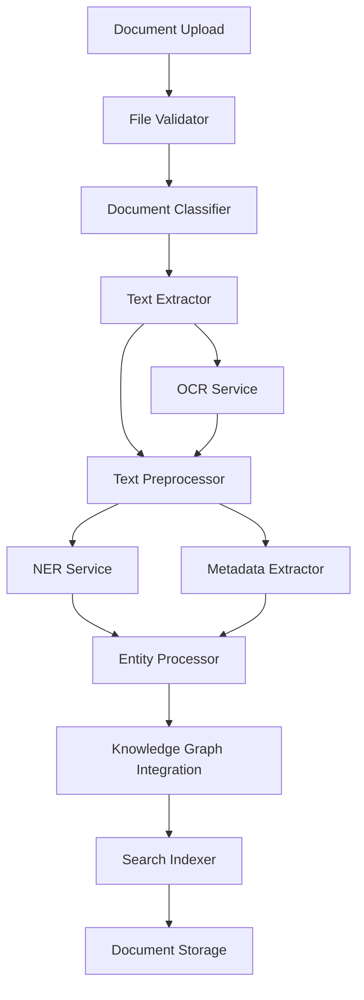

# Document Ingestion Pipeline Specification

## Overview

The Document Ingestion Pipeline is responsible for processing uploaded legal documents, extracting text and metadata, performing Named Entity Recognition (NER), and integrating the extracted information into the knowledge graph. This component bridges the gap between raw document uploads and structured legal knowledge.

## Pipeline Architecture



## Core Components

### 1. File Validation and Classification

```python
from typing import List, Dict, Any, Optional, Union
from dataclasses import dataclass
from enum import Enum
import mimetypes
import magic
from pathlib import Path

class DocumentType(Enum):
    COMPLAINT = "complaint"
    MOTION = "motion"
    ANSWER = "answer"
    DISCOVERY_REQUEST = "discovery_request"
    DISCOVERY_RESPONSE = "discovery_response"
    DEPOSITION = "deposition"
    EXHIBIT = "exhibit"
    CONTRACT = "contract"
    CORRESPONDENCE = "correspondence"
    COURT_ORDER = "court_order"
    JUDGMENT = "judgment"
    SETTLEMENT = "settlement"
    EXPERT_REPORT = "expert_report"
    MEDICAL_RECORD = "medical_record"
    FINANCIAL_DOCUMENT = "financial_document"
    UNKNOWN = "unknown"

class FileFormat(Enum):
    PDF = "pdf"
    DOCX = "docx"
    DOC = "doc"
    TXT = "txt"
    RTF = "rtf"
    HTML = "html"
    EMAIL = "email"

@dataclass
class DocumentMetadata:
    """Metadata extracted from document analysis"""
    file_name: str
    file_size: int
    file_format: FileFormat
    document_type: DocumentType
    confidence: float
    
    # Content metadata
    page_count: Optional[int] = None
    word_count: Optional[int] = None
    character_count: Optional[int] = None
    
    # Legal metadata
    case_number: Optional[str] = None
    court: Optional[str] = None
    jurisdiction: Optional[str] = None
    filing_date: Optional[str] = None
    document_date: Optional[str] = None
    
    # Parties
    parties: List[str] = None
    attorneys: List[str] = None
    
    # Document structure
    has_signature: bool = False
    has_exhibits: bool = False
    exhibit_count: int = 0
    
    # Quality indicators
    text_quality: float = 1.0  # 0-1 score for OCR quality
    scan_quality: Optional[float] = None
    contains_handwriting: bool = False
    
    def __post_init__(self):
        if self.parties is None:
            self.parties = []
        if self.attorneys is None:
            self.attorneys = []

class FileValidator:
    """Validates uploaded files for security and format compliance"""
    
    ALLOWED_MIME_TYPES = {
        'application/pdf',
        'application/vnd.openxmlformats-officedocument.wordprocessingml.document',
        'application/msword',
        'text/plain',
        'text/rtf',
        'text/html',
        'message/rfc822'
    }
    
    MAX_FILE_SIZE = 50 * 1024 * 1024  # 50MB
    
    def __init__(self):
        self.magic_detector = magic.Magic(mime=True)
    
    async def validate_file(self, file_path: str) -> Dict[str, Any]:
        """Validate uploaded file for security and format"""
        validation_result = {
            'valid': False,
            'file_format': None,
            'mime_type': None,
            'errors': [],
            'warnings': []
        }
        
        try:
            file_path = Path(file_path)
            
            # Check file exists
            if not file_path.exists():
                validation_result['errors'].append("File does not exist")
                return validation_result
            
            # Check file size
            file_size = file_path.stat().st_size
            if file_size > self.MAX_FILE_SIZE:
                validation_result['errors'].append(f"File too large: {file_size} bytes")
                return validation_result
            
            if file_size == 0:
                validation_result['errors'].append("File is empty")
                return validation_result
            
            # Detect MIME type
            mime_type = self.magic_detector.from_file(str(file_path))
            validation_result['mime_type'] = mime_type
            
            # Check allowed MIME types
            if mime_type not in self.ALLOWED_MIME_TYPES:
                validation_result['errors'].append(f"Unsupported file type: {mime_type}")
                return validation_result
            
            # Determine file format
            file_format = self._mime_to_format(mime_type)
            validation_result['file_format'] = file_format
            
            # Additional format-specific validation
            format_validation = await self._validate_format_specific(file_path, file_format)
            validation_result['warnings'].extend(format_validation.get('warnings', []))
            
            if format_validation.get('errors'):
                validation_result['errors'].extend(format_validation['errors'])
                return validation_result
            
            validation_result['valid'] = True
            return validation_result
            
        except Exception as e:
            validation_result['errors'].append(f"Validation error: {str(e)}")
            return validation_result
    
    def _mime_to_format(self, mime_type: str) -> FileFormat:
        """Convert MIME type to FileFormat enum"""
        mime_mapping = {
            'application/pdf': FileFormat.PDF,
            'application/vnd.openxmlformats-officedocument.wordprocessingml.document': FileFormat.DOCX,
            'application/msword': FileFormat.DOC,
            'text/plain': FileFormat.TXT,
            'text/rtf': FileFormat.RTF,
            'text/html': FileFormat.HTML,
            'message/rfc822': FileFormat.EMAIL
        }
        return mime_mapping.get(mime_type, FileFormat.PDF)

class DocumentClassifier:
    """Classifies documents by type using ML and rule-based approaches"""
    
    def __init__(self, llm_service):
        self.llm_service = llm_service
        self.rule_patterns = self._initialize_rule_patterns()
    
    async def classify_document(self, text_content: str, 
                              metadata: DocumentMetadata) -> DocumentType:
        """Classify document type using multiple approaches"""
        
        # Rule-based classification
        rule_result = self._classify_by_rules(text_content)
        
        # LLM-based classification for complex cases
        if rule_result == DocumentType.UNKNOWN:
            llm_result = await self._classify_by_llm(text_content)
            return llm_result
        
        return rule_result
    
    def _classify_by_rules(self, text: str) -> DocumentType:
        """Classify using rule-based patterns"""
        text_lower = text.lower()
        
        # Complaint patterns
        if any(pattern in text_lower for pattern in [
            'complaint for', 'plaintiff alleges', 'cause of action',
            'wherefore, plaintiff', 'jury trial demanded'
        ]):
            return DocumentType.COMPLAINT
        
        # Motion patterns
        if any(pattern in text_lower for pattern in [
            'motion for', 'motion to', 'notice of motion',
            'moving party', 'good cause appearing'
        ]):
            return DocumentType.MOTION
        
        # Answer patterns
        if any(pattern in text_lower for pattern in [
            'answer to', 'defendant denies', 'affirmative defense',
            'admits the allegations', 'denies the allegations'
        ]):
            return DocumentType.ANSWER
        
        # Add more patterns...
        
        return DocumentType.UNKNOWN
    
    async def _classify_by_llm(self, text: str) -> DocumentType:
        """Classify using LLM when rules are insufficient"""
        prompt = f"""
        Classify this legal document into one of these categories:
        - complaint
        - motion
        - answer
        - discovery_request
        - discovery_response
        - deposition
        - exhibit
        - contract
        - correspondence
        - court_order
        - judgment
        - settlement
        - expert_report
        - medical_record
        - financial_document
        - unknown
        
        Document text (first 2000 characters):
        {text[:2000]}
        
        Classification:"""
        
        response = await self.llm_service.generate_content(prompt, {})
        
        # Parse response and return appropriate DocumentType
        classification = response.content.strip().lower()
        try:
            return DocumentType(classification)
        except ValueError:
            return DocumentType.UNKNOWN
```

### 2. Text Extraction Engine

```python
import PyPDF2
import fitz  # PyMuPDF
from docx import Document
import pytesseract
from PIL import Image
import io

class TextExtractionEngine:
    """Multi-format text extraction with OCR fallback"""
    
    def __init__(self):
        self.pdf_extractor = PDFTextExtractor()
        self.docx_extractor = DOCXTextExtractor()
        self.ocr_service = OCRService()
    
    async def extract_text(self, file_path: str, 
                          file_format: FileFormat) -> Dict[str, Any]:
        """Extract text from document with metadata"""
        
        extraction_result = {
            'text': '',
            'pages': [],
            'metadata': {},
            'extraction_method': 'direct',
            'quality_score': 1.0,
            'errors': []
        }
        
        try:
            if file_format == FileFormat.PDF:
                result = await self.pdf_extractor.extract(file_path)
            elif file_format == FileFormat.DOCX:
                result = await self.docx_extractor.extract(file_path)
            elif file_format == FileFormat.DOC:
                # Convert to DOCX first or use alternative method
                result = await self._extract_doc(file_path)
            elif file_format == FileFormat.TXT:
                result = await self._extract_txt(file_path)
            else:
                raise ValueError(f"Unsupported format: {file_format}")
            
            extraction_result.update(result)
            
            # OCR fallback for poor quality text
            if result.get('quality_score', 1.0) < 0.5:
                ocr_result = await self.ocr_service.extract_text(file_path)
                if ocr_result.get('quality_score', 0) > result.get('quality_score', 0):
                    extraction_result.update(ocr_result)
                    extraction_result['extraction_method'] = 'ocr_fallback'
            
        except Exception as e:
            extraction_result['errors'].append(f"Extraction failed: {str(e)}")
            
            # Try OCR as last resort
            try:
                ocr_result = await self.ocr_service.extract_text(file_path)
                extraction_result.update(ocr_result)
                extraction_result['extraction_method'] = 'ocr_emergency'
            except Exception as ocr_e:
                extraction_result['errors'].append(f"OCR fallback failed: {str(ocr_e)}")
        
        return extraction_result

class PDFTextExtractor:
    """Specialized PDF text extraction"""
    
    async def extract(self, file_path: str) -> Dict[str, Any]:
        """Extract text from PDF with structure preservation"""
        
        result = {
            'text': '',
            'pages': [],
            'metadata': {},
            'quality_score': 1.0
        }
        
        # Try PyMuPDF first (better for complex layouts)
        try:
            doc = fitz.open(file_path)
            
            for page_num in range(doc.page_count):
                page = doc[page_num]
                page_text = page.get_text()
                
                # Analyze text quality
                quality = self._assess_text_quality(page_text)
                
                page_info = {
                    'number': page_num + 1,
                    'text': page_text,
                    'quality_score': quality,
                    'bbox': page.rect,  # Page dimensions
                    'rotation': page.rotation
                }
                
                result['pages'].append(page_info)
                result['text'] += page_text + '\n\n'
            
            # Calculate overall quality
            if result['pages']:
                result['quality_score'] = sum(p['quality_score'] for p in result['pages']) / len(result['pages'])
            
            # Extract PDF metadata
            result['metadata'] = {
                'page_count': doc.page_count,
                'title': doc.metadata.get('title', ''),
                'author': doc.metadata.get('author', ''),
                'subject': doc.metadata.get('subject', ''),
                'creator': doc.metadata.get('creator', ''),
                'producer': doc.metadata.get('producer', ''),
                'creation_date': doc.metadata.get('creationDate', ''),
                'modification_date': doc.metadata.get('modDate', '')
            }
            
            doc.close()
            
        except Exception as e:
            # Fallback to PyPDF2
            result = await self._extract_with_pypdf2(file_path)
        
        return result
    
    def _assess_text_quality(self, text: str) -> float:
        """Assess quality of extracted text (0-1 score)"""
        if not text or len(text.strip()) == 0:
            return 0.0
        
        # Check for OCR artifacts
        artifacts = ['�', '�', 'l~', 'rn', 'I I']
        artifact_count = sum(text.count(artifact) for artifact in artifacts)
        
        # Check for reasonable word/character ratio
        words = text.split()
        if not words:
            return 0.0
        
        avg_word_length = sum(len(word) for word in words) / len(words)
        
        # Check for proper spacing and formatting
        space_ratio = text.count(' ') / len(text) if text else 0
        
        # Calculate quality score
        quality = 1.0
        quality -= min(artifact_count / len(text) * 10, 0.5)  # Penalize artifacts
        quality -= abs(avg_word_length - 5) / 20  # Penalize unusual word lengths
        quality -= abs(space_ratio - 0.15) * 2  # Penalize unusual spacing
        
        return max(0.0, min(1.0, quality))

class OCRService:
    """OCR service for scanned documents and poor-quality PDFs"""
    
    def __init__(self):
        # Configure Tesseract for legal documents
        self.tesseract_config = r'--oem 3 --psm 6 -c tessedit_char_whitelist=ABCDEFGHIJKLMNOPQRSTUVWXYZabcdefghijklmnopqrstuvwxyz0123456789.,;:!?()[]{}"\'-+= '
    
    async def extract_text(self, file_path: str) -> Dict[str, Any]:
        """Extract text using OCR"""
        
        result = {
            'text': '',
            'pages': [],
            'extraction_method': 'ocr',
            'quality_score': 0.0
        }
        
        if file_path.lower().endswith('.pdf'):
            # Convert PDF pages to images for OCR
            doc = fitz.open(file_path)
            
            for page_num in range(doc.page_count):
                page = doc[page_num]
                
                # Convert page to image
                mat = fitz.Matrix(2.0, 2.0)  # 2x zoom for better OCR
                pix = page.get_pixmap(matrix=mat)
                img_data = pix.tobytes("png")
                
                # OCR the image
                image = Image.open(io.BytesIO(img_data))
                page_text = pytesseract.image_to_string(image, config=self.tesseract_config)
                
                # Assess OCR quality
                confidence_data = pytesseract.image_to_data(image, output_type=pytesseract.Output.DICT)
                confidences = [int(conf) for conf in confidence_data['conf'] if int(conf) > 0]
                avg_confidence = sum(confidences) / len(confidences) if confidences else 0
                
                page_info = {
                    'number': page_num + 1,
                    'text': page_text,
                    'ocr_confidence': avg_confidence,
                    'quality_score': avg_confidence / 100.0
                }
                
                result['pages'].append(page_info)
                result['text'] += page_text + '\n\n'
            
            doc.close()
            
            # Calculate overall quality
            if result['pages']:
                result['quality_score'] = sum(p['quality_score'] for p in result['pages']) / len(result['pages'])
        
        return result
```

### 3. Document Processing Pipeline

```python
class DocumentProcessingPipeline:
    """Main pipeline orchestrating document processing"""
    
    def __init__(self, knowledge_graph, ner_service, llm_service):
        self.knowledge_graph = knowledge_graph
        self.ner_service = ner_service
        self.llm_service = llm_service
        
        self.validator = FileValidator()
        self.classifier = DocumentClassifier(llm_service)
        self.text_extractor = TextExtractionEngine()
        self.metadata_extractor = MetadataExtractor()
        
    async def process_document(self, file_path: str, 
                             user_context: Dict[str, Any] = None) -> Dict[str, Any]:
        """Process a document through the complete pipeline"""
        
        processing_result = {
            'document_id': self._generate_document_id(),
            'status': 'processing',
            'stages': {},
            'errors': [],
            'warnings': []
        }
        
        try:
            # Stage 1: Validation
            validation = await self.validator.validate_file(file_path)
            processing_result['stages']['validation'] = validation
            
            if not validation['valid']:
                processing_result['status'] = 'failed'
                processing_result['errors'].extend(validation['errors'])
                return processing_result
            
            file_format = validation['file_format']
            
            # Stage 2: Text Extraction
            extraction = await self.text_extractor.extract_text(file_path, file_format)
            processing_result['stages']['extraction'] = extraction
            
            if extraction['errors']:
                processing_result['warnings'].extend(extraction['errors'])
            
            text_content = extraction['text']
            if not text_content or len(text_content.strip()) < 100:
                processing_result['errors'].append("Insufficient text content extracted")
                processing_result['status'] = 'failed'
                return processing_result
            
            # Stage 3: Document Classification
            doc_metadata = DocumentMetadata(
                file_name=Path(file_path).name,
                file_size=Path(file_path).stat().st_size,
                file_format=file_format,
                document_type=DocumentType.UNKNOWN,
                confidence=0.0
            )
            
            doc_type = await self.classifier.classify_document(text_content, doc_metadata)
            doc_metadata.document_type = doc_type
            processing_result['stages']['classification'] = {
                'document_type': doc_type.value,
                'confidence': 0.8  # Would be calculated by classifier
            }
            
            # Stage 4: Metadata Extraction
            metadata = await self.metadata_extractor.extract_metadata(
                text_content, doc_metadata, user_context
            )
            processing_result['stages']['metadata'] = metadata
            
            # Stage 5: Named Entity Recognition
            entities = await self.ner_service.extract_entities(
                text_content, processing_result['document_id']
            )
            processing_result['stages']['ner'] = {
                'entity_count': len(entities),
                'entity_types': list(set(e.type.value for e in entities))
            }
            
            # Stage 6: Knowledge Graph Integration
            kg_result = await self._integrate_with_knowledge_graph(
                entities, metadata, processing_result['document_id']
            )
            processing_result['stages']['knowledge_graph'] = kg_result
            
            # Stage 7: Document Storage and Indexing
            storage_result = await self._store_and_index_document(
                file_path, text_content, metadata, processing_result['document_id']
            )
            processing_result['stages']['storage'] = storage_result
            
            processing_result['status'] = 'completed'
            
        except Exception as e:
            processing_result['status'] = 'failed'
            processing_result['errors'].append(f"Pipeline error: {str(e)}")
        
        return processing_result
    
    async def _integrate_with_knowledge_graph(self, entities, metadata, document_id):
        """Integrate extracted entities and relationships into knowledge graph"""
        
        # Add entities to knowledge graph
        added_entities = []
        for entity in entities:
            entity_id = await self.knowledge_graph.add_entity(entity)
            added_entities.append(entity_id)
        
        # Discover and add relationships
        relationships = await self._discover_relationships(entities, metadata)
        added_relationships = []
        for relationship in relationships:
            rel_id = await self.knowledge_graph.add_relationship(relationship)
            added_relationships.append(rel_id)
        
        return {
            'entities_added': len(added_entities),
            'relationships_added': len(added_relationships),
            'entity_ids': added_entities,
            'relationship_ids': added_relationships
        }
    
    async def _discover_relationships(self, entities, metadata):
        """Discover relationships between entities using various methods"""
        
        relationships = []
        
        # Rule-based relationship discovery
        rule_relationships = self._discover_rule_based_relationships(entities)
        relationships.extend(rule_relationships)
        
        # LLM-based relationship discovery for complex cases
        llm_relationships = await self._discover_llm_relationships(entities, metadata)
        relationships.extend(llm_relationships)
        
        return relationships
    
    def _generate_document_id(self) -> str:
        """Generate unique document ID"""
        import uuid
        return f"doc_{uuid.uuid4().hex[:12]}"
```

This document ingestion pipeline provides comprehensive processing capabilities for legal documents, from validation through knowledge graph integration, with proper error handling and quality assessment throughout the process.