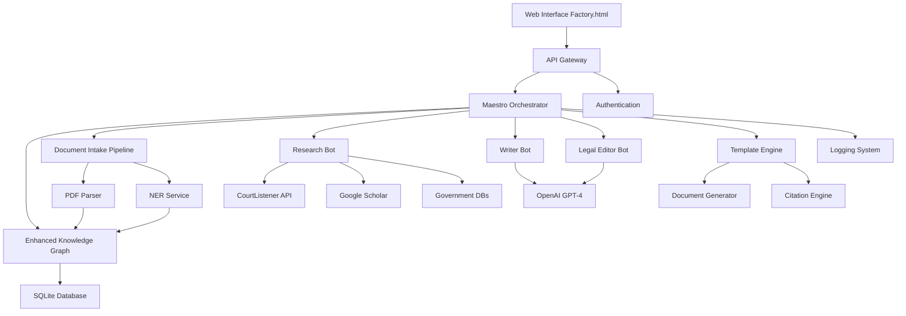
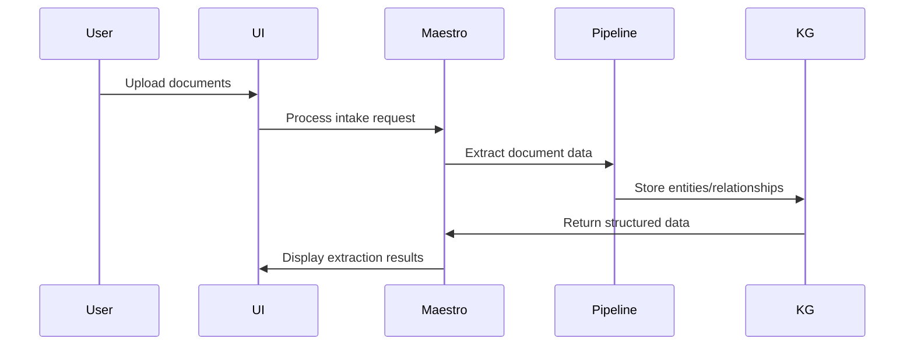
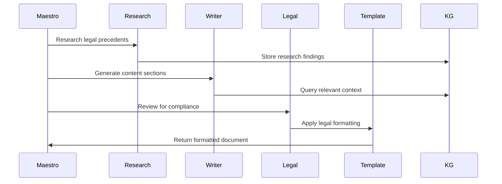

# LawyerFactory System Architecture

## Executive Summary

This document defines the complete system architecture for the LawyerFactory automated lawsuit generation system. The architecture bridges existing components (agent workflow, web UI, basic knowledge graph) with missing functionality to create a comprehensive legal document automation platform.

## Architecture Overview



## Core Components

### 1. Maestro Orchestration Engine

**Current State**: Basic orchestrator with placeholder bot coordination
**Required Enhancements**:

- **Workflow State Management**: Track task progress through 7-phase pipeline
- **Agent Coordination**: Manage communication between specialized bots
- **Context Management**: Maintain document context across phases
- **Error Recovery**: Handle bot failures and retry mechanisms

**Technical Specifications**:
```python
class EnhancedMaestro:
    def __init__(self):
        self.workflow_state = WorkflowState()
        self.knowledge_graph = KnowledgeGraph()
        self.agents = AgentRegistry()
        self.context_manager = ContextManager()
        
    async def execute_phase(self, phase: WorkflowPhase, context: dict) -> PhaseResult
    async def coordinate_agents(self, task: Task) -> AgentResponse
    def save_checkpoint(self, state: WorkflowState) -> None
    def restore_checkpoint(self, session_id: str) -> WorkflowState
```

### 2. Enhanced Knowledge Graph

**Current State**: JSON-based entity storage with basic relationships
**Required Enhancements**:

- **NER Integration**: Extract legal entities (parties, dates, jurisdictions, claims)
- **Relationship Mapping**: Complex legal relationships and dependencies
- **Semantic Search**: Vector embeddings for content similarity
- **Legal Ontology**: Domain-specific entity types and relationships

**Schema Design**:
```python
class LegalEntity:
    id: str
    type: EntityType  # PARTY, CLAIM, JURISDICTION, DATE, STATUTE, CASE
    attributes: Dict[str, Any]
    embeddings: Optional[List[float]]
    source_documents: List[str]
    
class LegalRelationship:
    from_entity: str
    to_entity: str
    relationship_type: RelationType
    confidence: float
    evidence: List[str]
```

### 3. Document Ingestion Pipeline

**Current State**: Basic file upload handling
**Required Implementation**:

- **PDF Text Extraction**: Extract text from legal documents
- **Document Classification**: Identify document types automatically
- **Named Entity Recognition**: Extract legal entities using spaCy/Transformers
- **Metadata Extraction**: Pull case numbers, dates, parties, jurisdictions

**Pipeline Architecture**:
```python
class DocumentPipeline:
    def __init__(self):
        self.pdf_parser = PDFParser()
        self.ner_service = NERService()
        self.classifier = DocumentClassifier()
        
    async def process_document(self, file_path: str) -> ProcessedDocument:
        text = await self.pdf_parser.extract_text(file_path)
        doc_type = await self.classifier.classify(text)
        entities = await self.ner_service.extract_entities(text)
        return ProcessedDocument(text, doc_type, entities)
```

### 4. LLM Integration Layer

**Architecture**: Single OpenAI GPT-4 provider with cost optimization

**Implementation**:
```python
class LLMService:
    def __init__(self, api_key: str):
        self.client = OpenAI(api_key=api_key)
        self.token_tracker = TokenTracker()
        self.rate_limiter = RateLimiter()
        
    async def generate_content(self, prompt: str, context: dict) -> LLMResponse:
        optimized_prompt = self.optimize_prompt(prompt, context)
        response = await self.client.chat.completions.create(
            model="gpt-4",
            messages=optimized_prompt,
            max_tokens=self.calculate_optimal_tokens(context)
        )
        self.token_tracker.log_usage(response.usage)
        return LLMResponse(response)
```

### 5. Research Bot with Legal Database Integration

**Target APIs**:
- CourtListener API for federal and state case law
- Google Scholar for academic legal research
- Government databases (regulations.gov, supremecourt.gov)

**Implementation**:
```python
class ResearchBot:
    def __init__(self):
        self.courtlistener = CourtListenerClient()
        self.scholar_scraper = ScholarScraper()
        self.gov_apis = GovernmentAPIClient()
        
    async def research_topic(self, query: ResearchQuery) -> ResearchResults:
        cases = await self.courtlistener.search_cases(query)
        articles = await self.scholar_scraper.search_articles(query)
        regulations = await self.gov_apis.search_regulations(query)
        return ResearchResults(cases, articles, regulations)
```

### 6. Modular Document Template System

**Legal Document Templates**:
- Complaint templates with IRAC structure
- Motion templates with jurisdiction-specific formatting
- Discovery templates with standard legal language
- Settlement agreement templates

**Template Engine**:
```python
class TemplateEngine:
    def __init__(self):
        self.jinja_env = JinjaEnvironment()
        self.citation_engine = CitationEngine()
        self.legal_formatter = LegalFormatter()
        
    def render_document(self, template_name: str, context: dict) -> Document:
        template = self.load_template(template_name)
        formatted_context = self.legal_formatter.format_context(context)
        return template.render(formatted_context)
```

## Data Flow Architecture

### Phase 1: Intake


### Phase 2-7: Workflow Execution


## Security Framework

**Local Desktop Security**:
- Encrypted local database storage (SQLite with SQLCipher)
- API key encryption and secure storage
- File system permissions and sandboxing
- Audit logging for all operations

**Implementation**:
```python
class SecurityManager:
    def __init__(self):
        self.encryption_key = self.load_master_key()
        self.audit_logger = AuditLogger()
        
    def encrypt_sensitive_data(self, data: str) -> str
    def decrypt_sensitive_data(self, encrypted_data: str) -> str
    def log_access(self, operation: str, user_context: dict) -> None
```

## Performance Requirements

**Target Specifications**:
- Document processing: < 30 seconds for 50-page PDF
- Research queries: < 2 minutes for comprehensive case law search
- Content generation: < 1 minute per document section
- Full lawsuit generation: < 15 minutes end-to-end

**Optimization Strategies**:
- Async processing for I/O operations
- Caching for research results and templates
- Batch processing for multiple documents
- Progressive loading for large document sets

## Error Handling & Quality Assurance

### Error Recovery
```python
class ErrorHandler:
    def __init__(self):
        self.retry_policies = RetryPolicyManager()
        self.fallback_strategies = FallbackManager()
        
    async def handle_llm_failure(self, context: dict) -> LLMResponse
    async def handle_research_failure(self, query: str) -> ResearchResults
    def log_error(self, error: Exception, context: dict) -> None
```

### Quality Validation
- Legal citation format validation
- IRAC structure compliance checking
- Factual consistency verification
- Template completeness validation

## Integration Points

### External APIs
- OpenAI GPT-4 API for content generation
- CourtListener REST API for case law
- Google Scholar web scraping (rate-limited)
- Government database APIs

### Internal Components
- SQLite database for persistent storage
- File system for document storage
- Web interface for user interactions
- Logging system for audit trails

## Technology Stack

**Backend**: Python 3.11+
**Database**: SQLite with SQLCipher encryption
**Web Interface**: HTML/JavaScript (existing factory.html)
**LLM Integration**: OpenAI Python SDK
**Document Processing**: PyPDF2, spaCy, python-docx
**API Clients**: httpx for async HTTP requests
**Testing**: pytest with async support

## Deployment Architecture

**Local Desktop Application**:
- Portable Python environment with dependencies
- Local web server for UI (Flask/FastAPI)
- SQLite database in user data directory
- Configuration management for API keys
- Auto-updater for system components

This architecture provides a comprehensive blueprint for transforming the current LawyerFactory prototype into a production-ready legal document automation system while maintaining the privacy and cost control requirements.