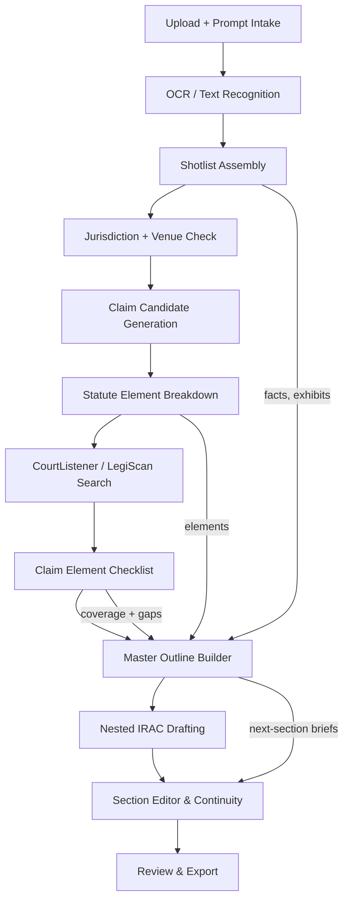

# Workflow DAG and Information Flow

The LawyerFactory pipeline treats each drafting effort as a directed acyclic graph (DAG) of stages that exchange structured context. OCR intake, prompt text, and exhibits are atomized into CTE-like slices (facts, parties, timelines) so downstream agents can reference stable nodes instead of duplicating parsing work.

## Stage Roles and Data Contracts
- **Upload + OCR:** Creates immutable CTE-style tables for source text, timelines, and entity references, tagged by jurisdiction and evidence type.
- **Shotlist Assembly:** Orders prompts and exhibits; annotates dependencies so the Maestro orchestrator can parallelize research while preserving chronology.
- **Research Track:** LegalResearchAgent decomposes each claim into elements, searches CourtListener/LegiScan per jurisdiction, and records citations plus bright-line rules or balancing factors in the checklist.
- **Outline Track:** Outliner merges the shotlist with research results into a master outline that reads like a prompt stack for writers.
- **Drafting Track:** Writer and LegalEditor bots execute nested IRAC (and System of Thirds) per claim, generating per-section memories for continuity editors.
- **Editorial Track:** Continuity editors maintain rolling context windows (done/current/next) to align tone, citations, and argument flow across sections.

## Progress Surfaces
- **StageTimeline:** Displays stage-level status from OCR through export, highlighting parallel research/drafting when enabled by the Maestro orchestrator.
- **ResearchChecklist:** Shows per-claim element coverage, citations, and outstanding searches, updating as LegalResearchAgent logs new authority.
- **WorkflowDAG:** Visual reference tying UI controls to orchestration checkpoints so users can track which agent owns each edge in the graph.
